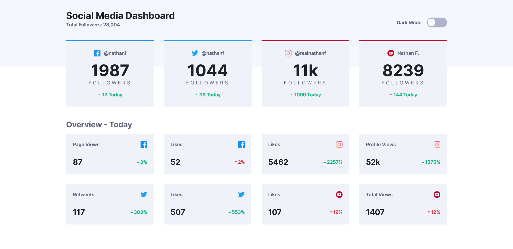

# Frontend Mentor - Social media dashboard with theme switcher solution

This is a solution to the [Social media dashboard with theme switcher challenge on Frontend Mentor](https://www.frontendmentor.io/challenges/social-media-dashboard-with-theme-switcher-6oY8ozp_H). Frontend Mentor challenges help you improve your coding skills by building realistic projects. 

## Table of contents

- [Overview](#overview)
  - [The challenge](#the-challenge)
  - [Screenshot](#screenshot)
  - [Links](#links)
- [My process](#my-process)
  - [Built with](#built-with)
  - [What I learned](#what-i-learned)
  - [Continued development](#continued-development)
  - [Useful resources](#useful-resources)
- [Author](#author)
- [Acknowledgments](#acknowledgments)

## Overview

### The challenge

Users should be able to:

- View the optimal layout for the site depending on their device's screen size
- See hover states for all interactive elements on the page
- Toggle color theme to their preference

### Screenshot

### Links

- Solution URL: [*VIEW CODE*](https://github.com/Phurba-Sherpa/frontend-mentor--social-media-dashboard)
- Live Site URL: [*PREVIEW SITE*](https://phurba-sherpa.github.io/frontend-mentor--social-media-dashboard/)

## My process

### Built with

- Semantic HTML5 markup
- CSS custom properties
- Flexbox
- CSS Grid
- Mobile-first workflow

### What I learned

First time with implementing theme feature and it was quite easy. Great learning

## Author

### Continued development

I can write html and css code that works fine. But I am really bad at writing semantic html, minimal css and full fledge responsivness. Also not good with animation. Also currently I take a lot of time to build the UI. In future I will want to build more robust UI with tricks of Grid. Also want to be more effective when it comes to the timing.

## Author

- Website - [*PHURBA SHERPA PORTFOLIO*](https://phurba.sherpa.name.np)
- Frontend Mentor - [*@Phurba-Sherpa*](https://www.frontendmentor.io/profile/Phurba-Sherpa)
- Medium - [*@phurba*](https://medium.com/@phurba)
